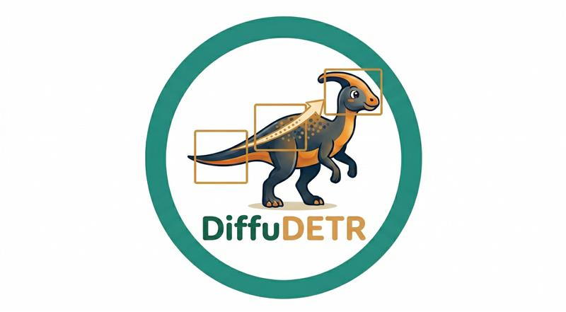
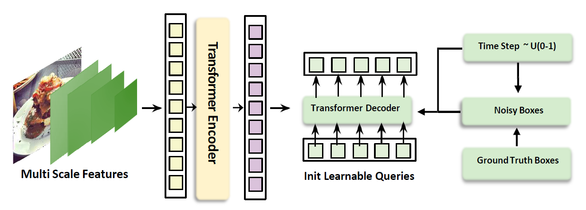
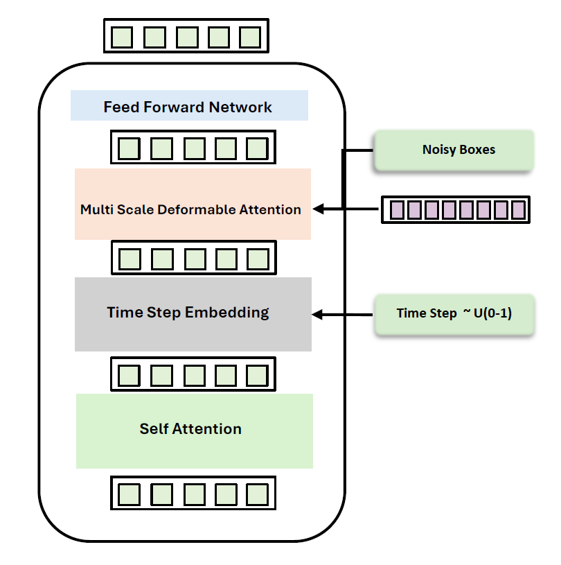
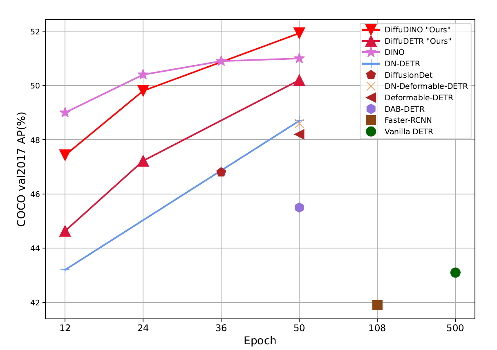

<div align="center">
<div align="center">  </div>

[](https://mbadran2000.github.io/DiffuDETR/)
[](https://iclr.cc/virtual/2026/poster/10007459)
[](https://huggingface.co/MBadran/DiffuDETR/tree/main/checkpoints)


# DiffuDETR: Rethinking Detection Transformers with Denoising Diffusion Process

### [ICLR 2026](https://iclr.cc/virtual/2026/poster/10007459)

**[Youssef Nawar](https://scholar.google.com/citations?hl=en&user=HQWsM2gAAAAJ)\*&nbsp;&nbsp;&nbsp;[Mohamed Badran](https://scholar.google.com/citations?hl=en&user=HkQmlHoAAAAJ)\*&nbsp;&nbsp;&nbsp;[Marwan Torki](https://scholar.google.com/citations?hl=en&user=aYLNZT4AAAAJ)**

Alexandria University &nbsp;·&nbsp; Technical University of Munich &nbsp;·&nbsp; Applied Innovation Center

<sub>* Equal Contribution</sub>


<br>



<p align="center"><em>DiffuDETR reformulates object detection as a <strong>conditional query generation task</strong> using denoising diffusion, improving strong baselines on COCO, LVIS, and V3Det.</em></p>

</div>

---

## 🔥 Highlights

<table>
<tr>
<td align="center"><h2>51.9</h2><sub>mAP on COCO</sub><br><code>+1.0 over DINO</code></td>
<td align="center"><h2>28.9</h2><sub>AP on LVIS</sub><br><code>+2.4 over DINO</code></td>
<td align="center"><h2>50.3</h2><sub>AP on V3Det</sub><br><code>+8.3 over DINO</code></td>
<td align="center"><h2>3×</h2><sub>Decoder Passes</sub><br><code>Only ~17% Extra FLOPs</code></td>
</tr>
</table>

- 🎯 **Diffusion-Based Query Generation** — Reformulates object detection in DETR as a denoising diffusion process, progressively denoising queries' reference points from Gaussian noise to precise object locations
- 🏗️ **Two Powerful Variants** — DiffuDETR (built on Deformable DETR) and DiffuDINO (built on DINO with contrastive denoising queries), demonstrating the generality of our approach
- ⚡ **Efficient Inference** — Only the lightweight decoder runs multiple times; backbone and encoder execute once, adding just ~17% extra FLOPs with 3 decoder passes
- 📊 **Consistent Gains Across Benchmarks** — Improvements on COCO 2017, LVIS, and V3Det across multiple backbones (ResNet-50, ResNet-101, Swin-B) with high multi-seed stability (±0.2 AP)

---

## 📋 Abstract

We present **DiffuDETR**, a novel approach that formulates object detection as a **conditional object query generation task**, conditioned on the image and a set of noisy reference points. We integrate DETR-based models with denoising diffusion training to generate object queries' reference points from a prior Gaussian distribution. We propose two variants: **DiffuDETR**, built on top of the Deformable DETR decoder, and **DiffuDINO**, based on DINO's decoder with contrastive denoising queries. To improve inference efficiency, we further introduce a lightweight sampling scheme that requires only multiple forward passes through the decoder.

Our method demonstrates consistent improvements across multiple backbones and datasets, including **COCO 2017**, **LVIS**, and **V3Det**, surpassing the performance of their respective baselines, with notable gains in complex and crowded scenes.

---

## 🏛️ Method

<div align="center">

<br>
<sub><b>Decoder Architecture</b> — Timestep embeddings are injected after self-attention, followed by multi-scale deformable cross-attention with noisy reference points attending to encoded image features.</sub>
</div>

<br>

### How It Works

| Step | Description |
|:---:|:---|
|  **Feature Extraction** | A backbone (ResNet / Swin) + transformer encoder extracts multi-scale image features |
|  **Forward Diffusion** *(training)* | Ground-truth box coordinates are corrupted with Gaussian noise at a random timestep $t \sim U(0, 100)$ via a cosine noise schedule |
|  **Reverse Denoising** *(inference)* | Reference points start as pure Gaussian noise and are iteratively denoised using DDIM sampling with only **3 decoder forward passes** |
|  **Timestep Conditioning** | The decoder integrates timestep embeddings after self-attention: $q_n = \text{FFN}(\text{MSDA}(\text{SA}(q_{n-1}) + t), r_t, O_{\text{enc}})$ |

---

## 📊 Main Results

### COCO 2017 val — Object Detection

| Model | Backbone | Epochs | AP | AP₅₀ | AP₇₅ | APₛ | APₘ | APₗ |
|:---|:---:|:---:|:---:|:---:|:---:|:---:|:---:|:---:|
| Pix2Seq | R50 | 300 | 43.2 | 61.0 | 46.1 | 26.6 | 47.0 | 58.6 |
| DiffusionDet | R50 | — | 46.8 | 65.3 | 51.8 | 29.6 | 49.3 | 62.2 |
| Deformable DETR | R50 | 50 | 48.2 | 67.0 | 52.2 | 30.7 | 51.4 | 63.0 |
| Align-DETR | R50 | 24 | 51.4 | 69.1 | 55.8 | 35.5 | 54.6 | 65.7 |
| DINO | R50 | 36 | 50.9 | 69.0 | 55.3 | 34.6 | 54.1 | 64.6 |
| **DiffuDETR (Ours)** | R50 | 50 | **50.2** *(+2.0)* | 66.8 | 55.2 | 33.3 | 53.9 | 65.8 |
| **DiffuAlignDETR (Ours)** | R50 | 24 | **51.9** *(+0.5)* | 69.2 | 56.4 | 34.9 | 55.6 | 66.2 |
| **DiffuDINO (Ours)** | R50 | 50 | **51.9** *(+1.0)* | 69.4 | 55.7 | 35.8 | 55.7 | 67.1 |
| Pix2Seq | R101 | 300 | 44.5 | 62.8 | 47.5 | 26.0 | 48.2 | 60.3 |
| DiffusionDet | R101 | — | 47.5 | 65.7 | 52.0 | 30.8 | 50.4 | 63.1 |
| Align-DETR | R101 | 12 | 51.2 | 68.8 | 55.7 | 32.9 | 55.1 | 66.6 |
| DINO | R101 | 12 | 50.0 | 67.7 | 54.4 | 32.2 | 53.4 | 64.3 |
| **DiffuAlignDETR (Ours)** | R101 | 12 | **51.7** *(+0.5)* | 69.3 | 56.1 | 34.0 | 55.6 | 67.0 |
| **DiffuDINO (Ours)** | R101 | 12 | **51.2** *(+1.2)* | 68.6 | 55.8 | 33.2 | 55.6 | 67.2 |

### LVIS val — Large Vocabulary Detection

| Model | Backbone | AP | AP₅₀ | APr | APc | APf |
|:---|:---:|:---:|:---:|:---:|:---:|:---:|
| DINO | R50 | 26.5 | 35.9 | 9.2 | 24.6 | 36.2 |
| **DiffuDINO (Ours)** | R50 | **28.9** *(+2.4)* | 38.5 | **13.7** *(+4.5)* | 27.6 | 36.9 |
| DINO | R101 | 30.9 | 40.4 | 13.9 | 29.7 | 39.7 |
| **DiffuDINO (Ours)** | R101 | **32.5** *(+1.6)* | 42.4 | 13.5 | 32.0 | 41.5 |

### V3Det val — Vast Vocabulary Detection (13,204 categories)

| Model | Backbone | AP | AP₅₀ | AP₇₅ |
|:---|:---:|:---:|:---:|:---:|
| DINO | R50 | 33.5 | 37.7 | 35.0 |
| **DiffuDINO (Ours)** | R50 | **35.7** *(+2.2)* | 41.4 | 37.7 |
| DINO | Swin-B | 42.0 | 46.8 | 43.9 |
| **DiffuDINO (Ours)** | Swin-B | **50.3** *(+8.3)* | 56.6 | 52.9 |

---

## 📈 Convergence & Qualitative Results

<div align="center">

<br>
<sub><b>Training Convergence</b> — COCO val2017 AP (%) vs. training epochs. DiffuDINO converges to the highest AP, surpassing all baseline methods.</sub>
</div>

<br>

<div align="center">

<br>
<sub><b>Qualitative Comparison</b> — Deformable DETR vs. DiffuDETR and DINO vs. DiffuDINO on COCO 2017 val. Our models produce more accurate and complete detections, especially in crowded scenes.</sub>
</div>

---

## 🔬 Ablation Studies

> All ablations on COCO 2017 val with DiffuDINO (R50 backbone).

| Ablation | Setting | AP |
|:---|:---|:---:|
| **Noise Distribution** | Gaussian *(best)* | **51.9** |
| | Sigmoid | 50.4 |
| | Beta | 49.5 |
| **Noise Scheduler** | Cosine *(best)* | **51.9** |
| | Linear | 51.6 |
| | Sqrt | 51.4 |
| **Decoder Evaluations** | 1 eval | 51.6 |
| | **3 evals** *(best)* | **51.9** |
| | 5 evals | 51.8 |
| | 10 evals | 51.4 |
| **FLOPs** | 1 eval → 244.5G | — |
| | 3 evals → 285.2G *(+17%)* | — |
| | 5 evals → 326.0G | — |

> 🛡️ **Multi-Seed Robustness:** Across 5 random seeds, standard deviation remains **below ±0.2 AP** in all settings.

---

## 🛠️ Installation

DiffuDETR is built on top of [detrex](https://github.com/IDEA-Research/detrex) and [detectron2](https://github.com/facebookresearch/detectron2).

### Prerequisites

- Linux with Python ≥ 3.11
- PyTorch ≥ 2.3.1 and corresponding torchvision
- CUDA 12.x

### Step-by-Step Setup

```bash
# 1. Create and activate conda environment
conda create -n diffudetr python=3.11 -y
conda activate diffudetr

# 2. Install PyTorch
pip install torch==2.3.1 torchvision==0.18.1 torchaudio==2.3.1 --index-url https://download.pytorch.org/whl/cu121

# 3. Clone and install detrex
git clone https://github.com/IDEA-Research/detrex.git
cd detrex
git submodule init
git submodule update

# 4. Install detectron2
python -m pip install -e detectron2 --no-build-isolation

# 5. Install detrex
pip install -e . --no-build-isolation

# 6. Fix setuptools compatibility
pip uninstall setuptools -y
pip install "setuptools<81"

# 7. Install additional dependencies
pip install pytorch_metric_learning lvis

# 8. Add DiffuDETR to PYTHONPATH
export PYTHONPATH="/path/to/DiffuDETR/:$PYTHONPATH"

# 9. Set dataset path
export DETECTRON2_DATASETS=/path/to/datasets/
```

### Dataset Preparation

Organize your datasets as follows:

```
$DETECTRON2_DATASETS/
├── coco/
│   ├── train2017/
│   ├── val2017/
│   └── annotations/
├── lvis/
│   ├── train2017/  (symlink to coco/train2017)
│   ├── val2017/    (symlink to coco/val2017)
│   └── annotations/
└── v3det/
    ├── images/
    └── annotations/
```

---

## 🚀 Usage

### Training

```bash
# DiffuDINO with ResNet-50 on COCO
python /path/to/detrex/tools/train_net.py \
    --num-gpus 2 \
    --config-file projects/diffu_dino/configs/dino-resnet/coco-r50-4scales-50ep.py

# DiffuDINO with ResNet-101 on COCO
python /path/to/detrex/tools/train_net.py \
    --num-gpus 2 \
    --config-file projects/diffu_dino/configs/dino-resnet/coco-r101-4scales-12ep.py

# DiffuDINO on V3Det
python /path/to/detrex/tools/train_net.py \
    --num-gpus 2 \
    --config-file projects/diffu_dino/configs/dino-resnet/v3det-r50-4scales-24ep.py

# DiffuAlignDETR on COCO
python /path/to/detrex/tools/train_net.py \
    --num-gpus 2 \
    --config-file projects/diffu_align_detr/configs/coco-r50-4scales-24ep.py
```

### Evaluation

```bash
python /path/to/detrex/tools/train_net.py \
    --num-gpus 2 \
    --eval-only \
    --config-file projects/diffu_dino/configs/dino-resnet/coco-r50-4scales-50ep.py \
    train.init_checkpoint=/path/to/checkpoint.pth
```

---

## 📁 Project Structure

```
DiffuDETR/
├── layers_diffu_detr/           # Core diffusion layers
│   ├── attention.py             # Attention mechanisms
│   ├── bbox_embedd.py           # Box embedding utilities
│   ├── denoising.py             # Diffusion denoising logic
│   ├── ldm/                     # Latent diffusion modules
│   ├── transformer.py           # Timestep-conditioned transformer
│   ├── multi_scale_deform_attn.py
│   └── ...
├── projects/
│   ├── diffu_dino/              # DiffuDINO model & configs
│   │   ├── configs/
│   │   │   ├── dino-resnet/     # ResNet backbone configs
│   │   │   └── dino-swin/       # Swin Transformer configs
│   │   ├── modeling/            # Model definitions
│   │   └── train_net.py         # Training script
│   └── diffu_align_detr/        # DiffuAlignDETR model & configs
│       ├── configs/
│       └── modeling/
├── datasets_utils/              # Dataset registration & configs
│   ├── lvis_detr.py
│   ├── v3det.py
│   └── ...
└── docs/                        # Project page & figures
```

---

## 📝 Citation

If you find DiffuDETR useful in your research, please consider citing our paper:

```bibtex
@inproceedings{nawar2026diffudetr,
  title     = {DiffuDETR: Rethinking Detection Transformers with Denoising Diffusion Process},
  author    = {Nawar, Youssef and Badran, Mohamed and Torki, Marwan},
  booktitle = {International Conference on Learning Representations (ICLR)},
  year      = {2026}
}
```

---

## 🙏 Acknowledgements

This project is built upon the following open-source works:

- [detrex](https://github.com/IDEA-Research/detrex) — Benchmarking Detection Transformers
- [detectron2](https://github.com/facebookresearch/detectron2) — Facebook AI Research's detection library
- [DINO](https://github.com/IDEA-Research/DINO) — DETR with Improved DeNoising Anchor Boxes
- [AlignDETR](https://github.com/FelixCaae/AlignDETR) — Improving DETR with IoU-Aware BCE Loss
- [DiffusionDet](https://github.com/ShoufaChen/DiffusionDet) — Diffusion Model for Object Detection

---

## 📄 License

This project is released under the [Apache 2.0 License](LICENSE).

---

<div align="center">

**[📄 Paper](https://iclr.cc/virtual/2026/poster/10007459) &nbsp;·&nbsp; [🤗 Model Weights](https://huggingface.co/MBadran/DiffuDETR/tree/main/checkpoints) &nbsp;·&nbsp; [🌐 Project Page](https://mbadran2000.github.io/DiffuDETR/) &nbsp;·&nbsp; [⭐ Star Us on GitHub](https://github.com/MBadran2000/DiffuDETR)**

</div>
